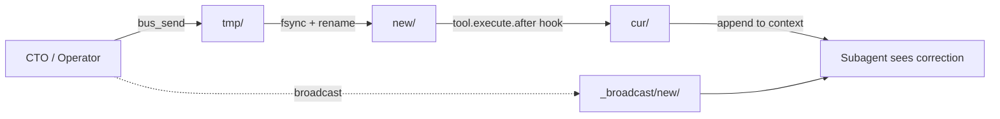

# OpenCode Agent Teams — Now Possible

Claude Code got agent teams in July 2026. You open two terminals, start two sessions, and they message each other. The lead can watch teammates in real time and send corrections mid-task. Pretty cool.

OpenCode had none of this. Subagents were fire-and-forget. No live messaging, no mid-task correction, no cross-session awareness.

**Turns out the mechanism was hiding in plain sight.** One undocumented plugin hook. `tool.execute.after`. It fires for every subagent session and can mutate the output before the model reads it. That single hook, plus a maildir spool for crash-safe delivery, gives you the whole thing. About 500 lines of code. Zero daemons, zero sockets.

## What's in here

A working implementation. You clone this, drop two MCP servers into your OpenCode config, copy one plugin file, and you can correct subagents mid-task from another terminal. Same machine only for now. Files on disk, no server required.

## Architecture



The operator drops a JSON message into the agent's maildir `new/` directory. The plugin hook grabs it on the next tool call, atomically moves it to `cur/`, and appends it to the tool output. The language model sees it next turn. No polling, no bash tools the model might skip. Deterministic.

## What the agent sees

```
⚠️ [SESSION-BUS] Messages:
  [cto→qa-agent]!! [correction]: Use bcrypt not sha256 for password hashing
```

## The discovery that makes this work

Subagents are not separate processes. They are conversations inside the parent session. Because they share the parent's process, they also share its plugin hooks. `tool.execute.after` fires for subagents. It gets the session ID and tool output. It can change that output. The model never opted in.

We tested this with a probe plugin. The hook fired. The subagent's transcript had our injected text. Deterministic, every time.

## Get it running

Clone the repo. You need OpenCode 1.18 or newer.

```bash
git clone https://github.com/semanticRig/cross-session-agent-messaging
```

Add these MCP servers to your OpenCode config:

```jsonc
"mcp": {
  "session-registry": {
    "type": "local",
    "command": ["python3", "./registry-server/mcp_server.py"],
    "enabled": true
  },
  "session-bus": {
    "type": "local",
    "command": ["python3", "./server/bus_mcp_server.py"],
    "enabled": true
  }
}
```

For automatic injection, copy `plugins/session-bus.ts` to your OpenCode plugins directory. Restart. Then:

```
bus_send("qa-agent", "check the login endpoint for SQL injection")
bus_peers()     → see who has pending messages
bus_inbox(...)  → read and deliver
```

## Known limits

- The hook fires after a tool call. If the subagent finishes its turn with no tool call, the message lands on the next one.
- At-least-once delivery. A crash between the rename into `new/` and the move to `cur/` can double-deliver. Message ID handles dedup.
- Undocumented hook contract. `tool.execute.after`'s payload shape can change between OpenCode versions. Tested on 1.18.15. We opened a spec PR to stabilize this: [#41305](https://github.com/anomalyco/opencode/pull/41305).
- Same machine only.

## Paper

Longer writeup with the full story: [paper.md](paper.md)

## Related

- OpenCode Issue: [#41304](https://github.com/anomalyco/opencode/issues/41304) — the discovery
- OpenCode PR: [#41305](https://github.com/anomalyco/opencode/pull/41305) — spec for hook stabilization
