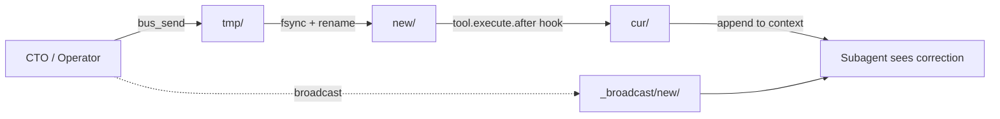

# Cross-Session Agent Messaging

Your OpenCode subagents are fire-and-forget. You dispatch them, they run, they report back. You cannot correct one mid-task without restarting it and losing context. This fixes that.

A maildir spool and one plugin hook. No daemons, no sockets, no model cooperation needed. About 500 lines of code total.

## Architecture



A message is a JSON file. The operator writes it to the agent's maildir `new/` directory. The plugin hook (`tool.execute.after`) fires on every tool call, atomically moves the message to `cur/`, and appends it to the tool output. The language model sees it on its next turn.

No polling. No bash tools that the model might skip. The hook fires deterministically.

## What an agent sees

```
⚠️ [SESSION-BUS] Messages:
  [cto→qa-agent]!! [correction]: Use bcrypt not sha256 for password hashing
```

## The discovery

OpenCode subagents share their parent's plugin hooks. `tool.execute.after` fires for every subagent session. It receives the session ID and the tool output text. It can mutate that output before the model reads it.

This was the missing piece. Earlier attempts assumed mid-turn injection was impossible in OpenCode. The mechanism was there the whole time.

## Try it

The code is in this repo. You need OpenCode 1.18+.

```bash
git clone https://github.com/semanticRig/cross-session-agent-messaging
```

Add the MCP servers to your OpenCode config (`~/.config/opencode/opencode.jsonc`):

```jsonc
"mcp": {
  "session-registry": {
    "type": "local",
    "command": ["python3", "./registry-server/mcp_server.py"],
    "enabled": true
  },
  "session-bus": {
    "type": "local",
    "command": ["python3", "./server/bus_mcp_server.py"],
    "enabled": true
  }
}
```

Restart OpenCode. The tools are available:

```
bus_send("qa-agent", "check the login endpoint for SQL injection")
bus_peers()     → lists agents with pending messages
bus_inbox(...)  → reads and delivers messages
```

For automatic injection into subagent context, copy `plugins/session-bus.ts` to your OpenCode plugins directory.

## Where this breaks

Honest limitations, because claims without caveats read like hype:

- The hook fires after a tool call. If the subagent emits a final answer with no further tool call, it will not see the message until the next tool turn.
- Delivery is at-least-once. A crash between `rename` into `new/` and the move to `cur/` can double-deliver. Handle idempotency by message ID.
- This builds on an undocumented hook contract. `tool.execute.after`'s payload shape can change between OpenCode versions. Tested against v1.18.15.
- The bus is same-machine only. Messages are files on disk.

## More detail
